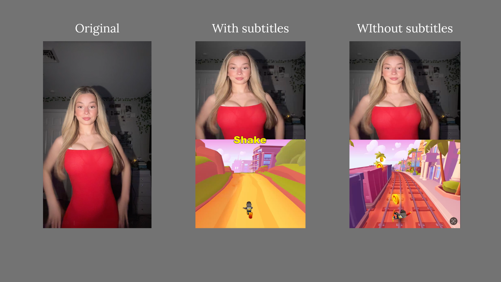

# Tiktok video uniqualizer
This app automatically makes your videos unique for YouTube, TikTok, and Instagram by adding dynamic gameplay footage to the bottom part of the screen.
<br>You can mix in Fortnite, Subway Surfers, Minecraft, and other games to boost viewer retention and reduce the risk of being flagged as reused content



## Dependencies
1. Python 3.14
2. Uv
3. Ffmpeg

## Setup Instructions (quick one)
1. **Clone the Repository**

```
git clone https://github.com/jjjohny228/video-uniqualizer-public.git
cd video-uniqualizer-public
```

2. **Run script**
```
setup.bash # Linux, MacOS
setup.bat # Windows
```

## Setup Instructions (long one)
1. **Clone the Repository**

2. **Clone the Repository**

```
git clone https://github.com/jjjohny228/video-uniqualizer-public.git
cd video-uniqualizer-public
```

3. **Download uv**

```
curl -LsSf https://astral.sh/uv/install.sh | less # macOS/Linux
PS> powershell -c "irm https://astral.sh/uv/install.ps1 | more" # Windows
```

4. **Download ffmpeg**

5. **Install python using uv**

```
uv python install 3.14
```

6. **Create .venv and activate virtual environment**

```
uv venv --python 314
source .venv/bin/activate # macOS/Linux
.venv\Scripts\activate # Windows
```

7. **Copy .env.example and create .env file**

```
cp .env.example .env
```

8. **Install dependencies**

```
uv sync --forzen
```

## How to use
1. Download game videos and put them to the bottom_videos folder. Here is a link to get test videos.
url

2. Setup subtitles variables
If you want to add subtitles get open ai api key and put it in .env file. Also change ADD_SUBTITLES to True

3. Start program.
Double click macos_start.command for macOS and Linux.
Double click windows_start.ps1 for windows.
Or just run 
```
uv run main.py
```

## Linting and formatting

```
ruff check .  # to check Python linting issues
ruff check . --fix  # try fix Python linting issues
```
